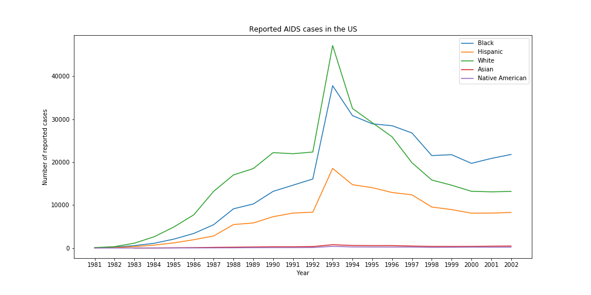

## Reviewed by cz1605:

#### CLARITY: 
* The plot is very clear, with axis, legend, title, lines and good font size.
* It is very simple and easy to get the core information of the plot since each of the 5 lines shows a very clear trend of the number of AIDS cases by one specific race from 1981 to 2012.
* I think the title should contain more information including 5 races and the caption part should briefly describe the content of figure.

#### AETHETIC: 
* The overall combination of the 5 colors is great which make it easy to distinguish one line from others.
* However the bottom two lines are too close. I think the blue for Native and the orange for Asian would a better choice to make these two lines clearer.

#### HONESTY: 
* The plot honestly reproduces the data. Although there were peaks in the lines, they did happen and the points of them are not intentionally emphasized.
